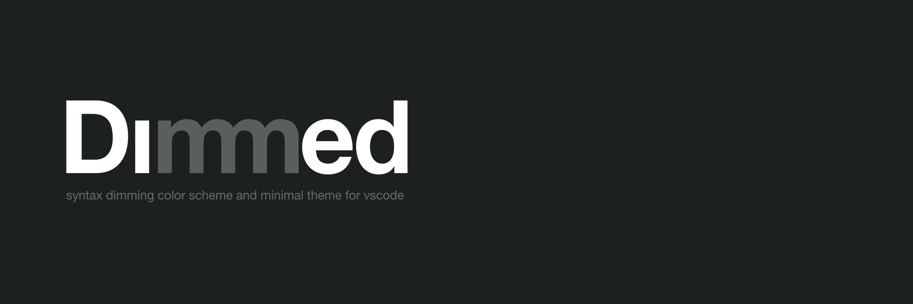
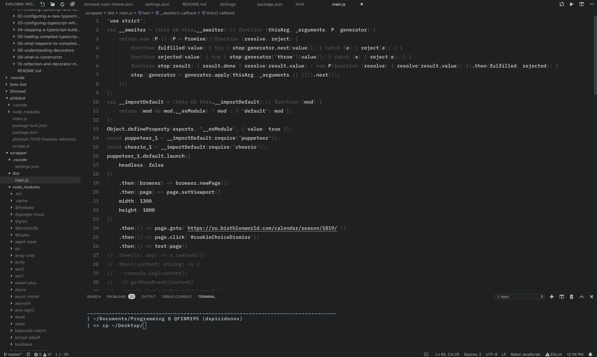
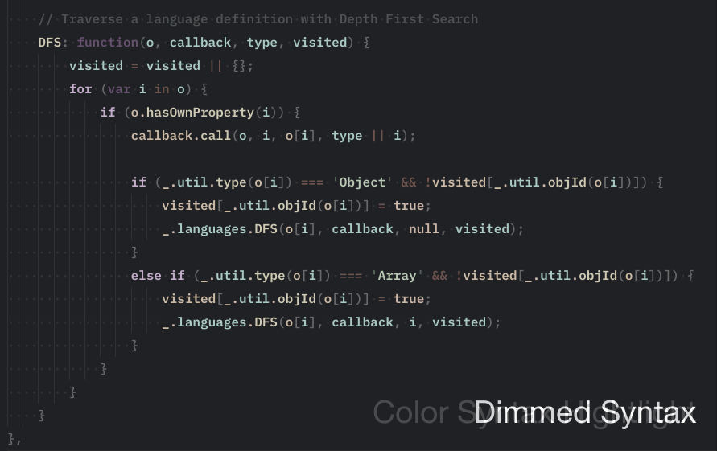

Dimmed theme is a experimental dimming syntax color scheme and minimal theme for VSCode

## Features

* Decreasing cognitive load by minimizing colors usage to highlight a code syntax

* Additional distractions minimization with minimal theme

* Contrast but eye-friendly

* Supported: Javascript, Typescript, HTML, CSS, Go, C, C++, Java, Python

## What is dimmed syntax

Some elements of the code that can add visual noise are colored less bright than context meaningful parts because additional colors add additional cognitive work to process it. With dimmed syntax, just two shades of gray are used + one additional shade for comments.

## Inspiration

* [vscode-theme-gruvbox](https://github.com/jdinhify/vscode-theme-gruvbox)
 Guys doing there great job by maintaining high quality theme which I decided to use as starting point and learn from it. Thanks a lot!

* [vim-monochrome](https://github.com/fxn/vim-monochrome)

* [white-theme-vscode](https://github.com/arthurwhite/white-theme-vscode)

## TODO

* Even more eye-friendly theme version with gruvbox main colors
* White version
